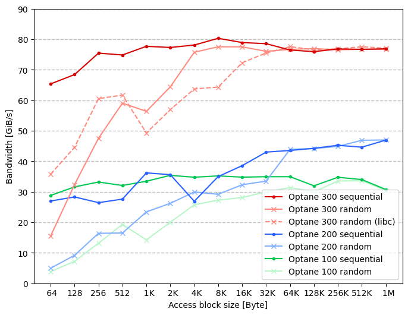
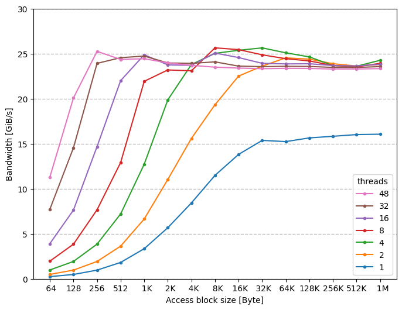
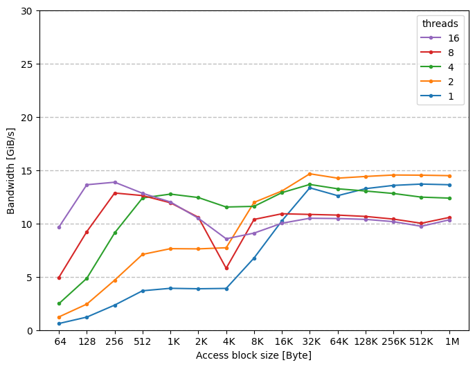

- [pmem2bench](#pmem2bench)
  - [Devdax sequential nt-store/noflush load access comparison](#devdax-sequential-nt-storenoflush-load-access-comparison)
  - [devdax write](#devdax-write)
  - [devdax read (noflush)](#devdax-read-noflush)

# pmem2bench
## Devdax sequential nt-store/noflush load access comparison

| write                                               | read                                               |
| :-------------------------------------------------- | :------------------------------------------------- |
|  |  |

## devdax write

|         | Pegasus (Optane 300)                                                             | chris90 (Optane 200)                                                             | chris80 (Optane 100)                                                             |
| :------ | :------------------------------------------------------------------------------- | :------------------------------------------------------------------------------- | :------------------------------------------------------------------------------- |
| seq-nt  |  |  |  |
| seq-t   |        |        |        |
| rand-nt |      |      |      |
| rand-t  |            |            |            |

## devdax read (noflush)

|               | Pegasus (Optane 300)                                                              | chris90 (Optane 200)                                                              | chris80 (Optane 100)                                                              |
| :------------ | :-------------------------------------------------------------------------------- | :-------------------------------------------------------------------------------- | :-------------------------------------------------------------------------------- |
| seq-libpmem2  |  |  |  |
| seq-glibc     |      |      |      |
| rand-libpmem2 |      |      |      |
| rand-glibc    |          |          |          |
